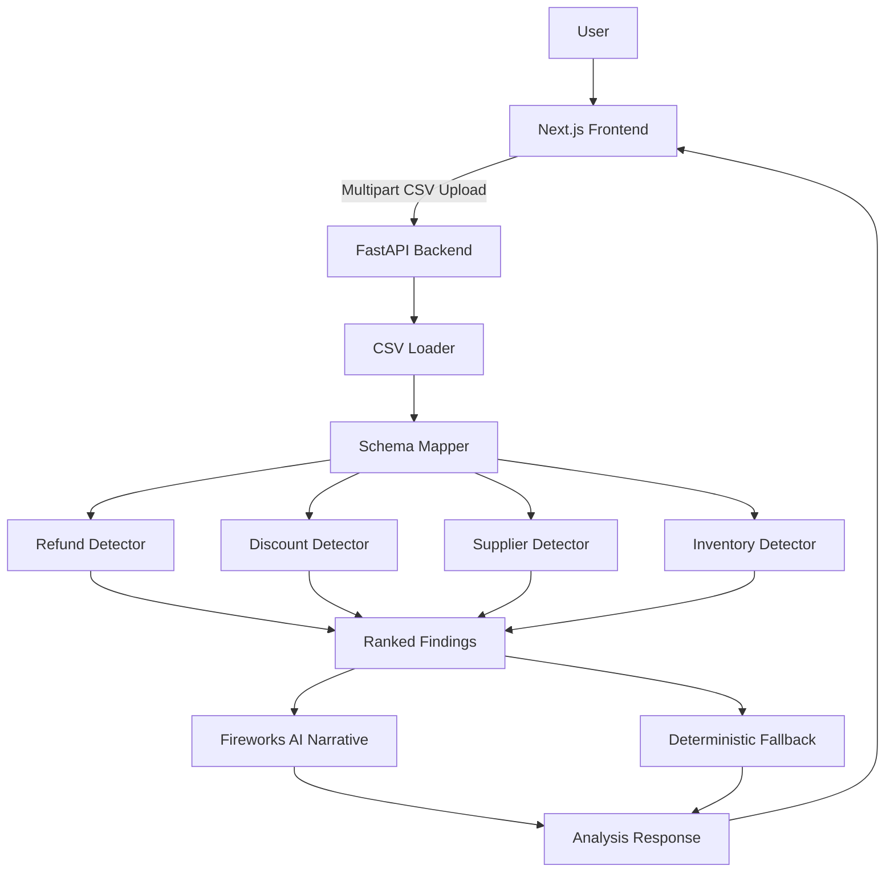

# LeakLogic AI

<div align="center">

## AI-Powered Profit Intelligence for Detecting Hidden Business Losses

**LeakLogic AI** analyzes sales, refunds, supplier costs, and inventory data to uncover hidden profit leaks, quantify their financial impact, and generate an executive-ready narrative using Fireworks AI.

[](https://fastapi.tiangolo.com/)
[](https://nextjs.org/)
[](https://fireworks.ai/)
[](https://www.docker.com/)
[](https://www.python.org/)
[](https://www.typescriptlang.org/)

**Find the leaks. Protect the profit.**

</div>

---

## Table of Contents

- [Overview](#overview)
- [Problem Statement](#problem-statement)
- [Solution](#solution)
- [Core Features](#core-features)
- [Supported Profit-Leak Categories](#supported-profit-leak-categories)
- [How the System Works](#how-the-system-works)
- [Architecture](#architecture)
- [Technology Stack](#technology-stack)
- [Repository Structure](#repository-structure)
- [Input Data Requirements](#input-data-requirements)
- [Installation and Local Setup](#installation-and-local-setup)
- [Environment Variables](#environment-variables)
- [Running with Docker](#running-with-docker)
- [API Documentation](#api-documentation)
- [Frontend Workflow](#frontend-workflow)
- [Example Analysis Output](#example-analysis-output)
- [Detection Logic](#detection-logic)
- [AI Narrative Layer](#ai-narrative-layer)
- [Fallback and Reliability](#fallback-and-reliability)
- [Testing](#testing)
- [Deployment](#deployment)
- [Production CORS Configuration](#production-cors-configuration)
- [Security and Data Privacy](#security-and-data-privacy)
- [Troubleshooting](#troubleshooting)
- [Known Limitations](#known-limitations)
- [Hackathon Alignment](#hackathon-alignment)
- [Roadmap](#roadmap)
- [Demo Script](#demo-script)
- [Contributing](#contributing)
- [License](#license)
- [Author](#author)

---

## Overview

Businesses often lose profit through small operational inefficiencies that are difficult to detect in ordinary reports. These losses may come from:

- discounts that reduce revenue without generating meaningful sales lift;
- abnormal refund patterns;
- supplier cost increases that compress margins;
- slow-moving or stagnant inventory;
- disconnected business data stored across multiple CSV files.

LeakLogic AI brings these data sources together into one analysis pipeline.

The platform:

1. accepts business CSV files;
2. normalizes the uploaded data;
3. runs deterministic profit-leak detectors;
4. calculates estimated financial impact;
5. ranks findings by importance;
6. generates an executive narrative using Fireworks AI;
7. displays the results in an interactive dashboard.

The analytical calculations are completed before any large language model is used. This keeps the financial findings explainable, traceable, and less dependent on generative AI.

---

## Problem Statement

Many small and medium-sized businesses have data but lack a practical way to turn that data into actionable financial insight.

Common challenges include:

- sales, refunds, suppliers, and inventory are stored separately;
- spreadsheet review is slow and error-prone;
- managers may notice losses only after they become significant;
- generic dashboards show what happened but not where profit is leaking;
- AI summaries may sound convincing while inventing unsupported explanations.

LeakLogic AI addresses these problems by combining deterministic analytics with a grounded narrative layer.

---

## Solution

LeakLogic AI acts as an AI-assisted business auditor.

It uses rule-based Python and pandas detectors to identify measurable profit leaks, then sends only the structured findings to Fireworks AI for executive explanation.

This hybrid design provides:

- accurate calculations;
- transparent evidence;
- actionable recommendations;
- readable management summaries;
- graceful fallback when the AI provider is unavailable.

---

## Core Features

### CSV-Based Business Audit

Upload:

- sales data;
- refund or return data;
- supplier or cost-of-goods data;
- inventory data.

Only the sales file is required. The remaining files are optional.

### Deterministic Profit-Leak Detection

The backend runs four analytical detectors:

- refund anomalies;
- discount leakage;
- supplier margin compression;
- inventory drag.

### Financial Impact Estimation

Each finding includes an estimated dollar impact so users can prioritize the largest issues first.

### Explainable Evidence

Every finding contains:

- category;
- affected entity;
- title;
- metric change;
- dollar impact;
- confidence score;
- time window;
- evidence;
- likely cause;
- suggested action.

### Fireworks AI Executive Narrative

The platform uses Fireworks AI to transform structured findings into a professional management summary.

### Deterministic Fallback

When the LLM is unavailable, the backend generates a basic summary without blocking the analysis.

### Interactive Dashboard

The frontend presents:

- total estimated leak;
- ranked findings;
- source statistics;
- revenue trend chart;
- executive summary;
- narrative source badge;
- system status;
- sample-data workflow.

### Docker Support

The frontend and backend can be built and run together using Docker Compose.

---

## Supported Profit-Leak Categories

| Category | Description | Example |
|---|---|---|
| Refund Anomaly | Detects unusual refund behavior | A product shows a sharp increase in refund rate |
| Discount Leakage | Finds promotions that reduce revenue per unit without useful lift | Heavy discounting produces no measurable incremental revenue |
| Supplier Pressure | Identifies supplier cost increases that compress margins | Unit cost rises while sale price remains unchanged |
| Inventory Drag | Detects stock tying up working capital | Inventory grows while product movement remains low |

---

## How the System Works

### Step 1: Upload

The user uploads one or more CSV files through the frontend.

### Step 2: Validation

The backend checks that the required sales file exists and that uploaded files are readable.

### Step 3: Schema Mapping

Common column names are normalized into the internal schema.

### Step 4: Detection

Each available data source is passed to the relevant detector.

### Step 5: Prioritization

Findings are sorted by estimated dollar impact.

### Step 6: Narrative Generation

The structured findings are sent to Fireworks AI with strict grounding instructions.

### Step 7: Dashboard Rendering

The frontend displays the results, evidence, actions, and charts.

---

## Architecture



### Backend Responsibility

The backend handles:

- file upload;
- CSV parsing;
- schema normalization;
- detector execution;
- chart aggregation;
- Fireworks AI integration;
- fallback summary generation;
- API response validation.

### Frontend Responsibility

The frontend handles:

- file selection;
- upload state;
- sample-data execution;
- audit submission;
- result rendering;
- chart visualization;
- executive narrative formatting;
- error display.

---

## Technology Stack

### Backend

- Python 3.12
- FastAPI
- pandas
- NumPy
- Pydantic
- pydantic-settings
- OpenAI-compatible Python SDK
- Uvicorn
- python-multipart

### Frontend

- Next.js 16
- React 19
- TypeScript
- Tailwind CSS
- Recharts
- React Markdown
- remark-gfm
- Lucide React
- Spline

### AI

- Fireworks AI
- Model: `accounts/fireworks/models/gpt-oss-120b`
- OpenAI-compatible chat completions
- Optional OpenRouter provider support
- Deterministic fallback summary

### DevOps

- Docker
- Docker Compose
- GitHub
- Environment-based configuration
- Dynamic deployment port support

---

## Repository Structure

```text
profit-leak-hunter/
├── backend/
│   ├── app/
│   │   ├── core/
│   │   │   └── config.py
│   │   ├── sample_data/
│   │   │   ├── sales.csv
│   │   │   ├── refunds.csv
│   │   │   ├── suppliers.csv
│   │   │   └── inventory.csv
│   │   ├── services/
│   │   │   ├── detectors/
│   │   │   │   ├── discounts.py
│   │   │   │   ├── inventory.py
│   │   │   │   ├── refunds.py
│   │   │   │   └── suppliers.py
│   │   │   ├── csv_loader.py
│   │   │   ├── narrative.py
│   │   │   ├── pipeline.py
│   │   │   └── schema_mapper.py
│   │   ├── main.py
│   │   └── schemas.py
│   ├── tests/
│   ├── .dockerignore
│   ├── .env.example
│   ├── Dockerfile
│   └── requirements.txt
│
├── frontend/
│   ├── app/
│   ├── components/
│   ├── lib/
│   │   └── api.ts
│   ├── public/
│   ├── types/
│   ├── .dockerignore
│   ├── Dockerfile
│   ├── next.config.ts
│   ├── package.json
│   └── package-lock.json
│
├── docs/
├── scripts/
├── compose.yml
├── .env.example
├── .gitignore
└── README.md
```

---

## Input Data Requirements

### Sales CSV — Required

Recommended fields:

| Column | Type | Description |
|---|---|---|
| `date` | Date | Transaction date |
| `product` | Text | Product or category |
| `quantity` | Numeric | Units sold |
| `unit_price` | Numeric | Selling price per unit |
| `discount` | Numeric | Discount amount or rate |
| `supplier` | Text | Supplier, when available |

Example:

```csv
date,product,quantity,unit_price,discount,supplier
2019-01-01,Sports and travel,4,95.00,5.00,Global Sports Ltd
2019-01-02,Electronic accessories,2,40.00,0.00,TechWholesale Inc
```

### Refunds CSV — Optional

| Column | Type | Description |
|---|---|---|
| `date` | Date | Refund date |
| `product` | Text | Refunded product |
| `quantity` | Numeric | Refunded units |
| `amount` | Numeric | Refund amount |

Example:

```csv
date,product,quantity,amount
2019-02-05,Sports and travel,2,180.00
```

### Suppliers CSV — Optional

| Column | Type | Description |
|---|---|---|
| `supplier` | Text | Supplier name |
| `product` | Text | Product |
| `unit_cost` | Numeric | Supplier cost per unit |
| `date` | Date | Cost record date |

Example:

```csv
supplier,product,unit_cost,date
TechWholesale Inc,Electronic accessories,34.00,2019-01-01
TechWholesale Inc,Electronic accessories,40.00,2019-03-01
```

### Inventory CSV — Optional

| Column | Type | Description |
|---|---|---|
| `product` | Text | Product |
| `stock_level` | Numeric | Available stock |
| `unit_cost` | Numeric | Cost per unit |
| `snapshot_date` | Date | Inventory snapshot date |

Example:

```csv
product,stock_level,unit_cost,snapshot_date
Home and lifestyle,650,44.00,2019-03-31
```

---

## Installation and Local Setup

### Prerequisites

Install:

- Git
- Python 3.12 or later
- Node.js 22 or later
- npm
- Docker Desktop, for containerized execution

### Clone the Repository

```bash
git clone https://github.com/builtbyrehan/leaklogic-ai.git
cd leaklogic-ai
```

---

## Backend Setup

### Windows PowerShell

```powershell
cd backend
python -m venv .venv
.venv\Scripts\activate
pip install -r requirements.txt
```

Create a private environment file:

```powershell
Copy-Item .env.example .env
```

Start the backend:

```powershell
python -m uvicorn app.main:app --reload
```

Backend URLs:

```text
API:      http://127.0.0.1:8000
Health:   http://127.0.0.1:8000/health
API Docs: http://127.0.0.1:8000/docs
```

---

## Frontend Setup

Open another terminal:

```powershell
cd frontend
npm install
npm run dev
```

Open:

```text
http://localhost:3000
```

The frontend uses the following backend URL by default:

```text
http://127.0.0.1:8000
```

To override it, create:

```text
frontend/.env.local
```

with:

```env
NEXT_PUBLIC_API_URL=http://127.0.0.1:8000
```

---

## Environment Variables

### Backend

Create `backend/.env`.

```env
APP_ENV=development

LLM_PROVIDER=fireworks
ENABLE_LLM_NARRATIVE=true

FIREWORKS_API_KEY=your_private_fireworks_api_key
FIREWORKS_API_BASE_URL=https://api.fireworks.ai/inference/v1
FIREWORKS_MODEL=accounts/fireworks/models/gpt-oss-120b

OPENROUTER_API_KEY=
OPENROUTER_API_BASE_URL=https://openrouter.ai/api/v1
OPENROUTER_MODEL=nvidia/nemotron-3-nano-30b-a3b:free
```

### Frontend

Create `frontend/.env.local`.

```env
NEXT_PUBLIC_API_URL=http://127.0.0.1:8000
```

### Security Rules

Never commit:

- `backend/.env`
- `frontend/.env.local`
- API keys
- deployment secrets

The repository `.gitignore` already excludes these files.

---

## Running with Docker

### Start the Full Application

From the project root:

```bash
docker compose up --build
```

Open:

```text
Frontend: http://localhost:3000
Backend:  http://localhost:8000
Docs:     http://localhost:8000/docs
```

### Stop

```bash
docker compose down
```

### Build the Backend Image Only

```bash
docker build -t leaklogic-backend ./backend
```

### Build the Frontend Image Only

```bash
docker build -t leaklogic-frontend ./frontend
```

### Run the Backend Image

```bash
docker run --rm \
  --name leaklogic-backend \
  --env-file backend/.env \
  -p 8000:8000 \
  leaklogic-backend
```

### Run the Frontend Image

```bash
docker run --rm \
  --name leaklogic-frontend \
  -p 3000:3000 \
  leaklogic-frontend
```

---

## API Documentation

### Health Check

```http
GET /health
```

Response:

```json
{
  "status": "ok",
  "service": "profit-leak-hunter-api",
  "version": "0.1.0"
}
```

### Get Sample Data

```http
GET /sample-data/{filename}
```

Examples:

```text
/sample-data/sales.csv
/sample-data/refunds.csv
/sample-data/suppliers.csv
/sample-data/inventory.csv
```

### Analyze Business Data

```http
POST /analyze
```

Content type:

```text
multipart/form-data
```

Form fields:

| Field | Required | Description |
|---|---:|---|
| `sales` | Yes | Sales CSV |
| `refunds` | No | Refund CSV |
| `suppliers` | No | Supplier or cost CSV |
| `inventory` | No | Inventory CSV |

### cURL Example

```bash
curl -X POST "http://localhost:8000/analyze" \
  -F "sales=@backend/app/sample_data/sales.csv" \
  -F "refunds=@backend/app/sample_data/refunds.csv" \
  -F "suppliers=@backend/app/sample_data/suppliers.csv" \
  -F "inventory=@backend/app/sample_data/inventory.csv"
```

---

## Frontend Workflow

1. Open the homepage.
2. Scroll to the Data Input Console.
3. Upload a sales CSV.
4. Optionally upload refund, supplier, and inventory files.
5. Click **Start Audit**.
6. Wait for the analysis to complete.
7. Review:
   - total estimated leak;
   - ranked findings;
   - supporting evidence;
   - suggested actions;
   - AI executive narrative;
   - charts and source statistics.

The **Try Sample Data** button automatically loads bundled sample files and runs a demonstration analysis.

---

## Example Analysis Output

```json
{
  "status": "success",
  "total_estimated_leak": -3742.13,
  "findings": [
    {
      "category": "discount",
      "entity": "Sports and travel",
      "title": "Discount campaign may be reducing profit",
      "metric_change": "$9.30 lower revenue per unit during discounts",
      "dollar_impact": -3742.13,
      "confidence": 0.78,
      "time_window": "Discounted sales vs regular sales",
      "evidence": [
        "Total discount cost: $3,742.13",
        "Estimated incremental revenue: $0.00",
        "Discounted units sold: 319"
      ],
      "likely_cause": "The discount reduced revenue per unit more than it generated useful sales lift.",
      "suggested_action": "Review discount depth and campaign targeting for Sports and travel."
    }
  ],
  "executive_summary": "## Executive Summary...",
  "narrative_source": "fireworks",
  "amd_usage_note": "Leak findings are generated by deterministic Python/pandas detectors...",
  "chart_data": {
    "revenue_over_time": [
      {
        "month": "2019-01",
        "value": 110754.16
      }
    ],
    "records_by_source": {
      "SALES": 1000,
      "REFUNDS": 0,
      "SUPPLIERS": 0,
      "INVENTORY": 0
    },
    "date_range": "Jan 2019 - Mar 2019"
  }
}
```

---

## Detection Logic

### Refund Anomaly Detector

The refund detector compares refund behavior by product or category.

It may identify:

- increased refund rate;
- unusual refund volume;
- financially material changes;
- products requiring operational review.

The detector returns supporting evidence and an estimated impact.

### Discount Leakage Detector

The discount detector compares revenue per unit between discounted and regular transactions.

It looks for:

- lower revenue per unit during discounts;
- high discount cost;
- insufficient incremental revenue;
- weak sales lift.

A campaign may be flagged when discounting reduces revenue without generating enough additional business to justify the reduction.

### Supplier Margin Compression Detector

The supplier detector analyzes changes in unit cost over time.

It may flag:

- supplier cost increases;
- selling prices that did not adjust;
- potential margin compression;
- supplier-product combinations requiring renegotiation.

### Inventory Drag Detector

The inventory detector evaluates stock movement and value.

It may identify:

- slow-moving inventory;
- stagnant stock;
- inventory accumulation;
- cash tied up in unsold products.

---

## AI Narrative Layer

### Provider

The current primary provider is Fireworks AI.

```text
Provider: Fireworks AI
Model: accounts/fireworks/models/gpt-oss-120b
```

### Purpose

The AI layer does not calculate findings.

It only converts detector output into a readable executive summary.

### Grounding Rules

The prompt instructs the model not to invent:

- figures;
- findings;
- evidence;
- causes;
- time periods;
- thresholds;
- recovery amounts;
- recommendations not present in the findings.

### Narrative Source

The API returns one of:

```text
fireworks
openrouter
fallback
```

The frontend displays the source in the result badge.

---

## Fallback and Reliability

LeakLogic AI is designed to continue working when the LLM is unavailable.

The application:

1. runs all deterministic detectors;
2. calculates findings and impact;
3. attempts AI narrative generation;
4. retries temporary failures;
5. falls back to a deterministic summary if needed.

This means the core business analysis does not depend on Fireworks AI availability.

---

## Testing

### Run Backend Tests

```powershell
cd backend
.venv\Scripts\activate
pytest
```

### Recommended Test Scenarios

- sales only;
- sales and refunds;
- sales and suppliers;
- sales and inventory;
- all four data sources;
- empty sales file;
- malformed CSV;
- missing optional files;
- missing Fireworks key;
- Fireworks API failure;
- fallback summary;
- Docker end-to-end execution.

### Manual API Test

Open:

```text
http://127.0.0.1:8000/docs
```

Use the interactive Swagger interface to call `/analyze`.

### Health Test

```powershell
Invoke-RestMethod http://127.0.0.1:8000/health
```

---

## Deployment

The project is container-ready.

### Backend Deployment Requirements

The backend platform must support:

- Docker;
- environment variables;
- outbound HTTPS requests;
- a public port;
- at least enough memory for Python, pandas, FastAPI, and request processing.

The backend Dockerfile supports a dynamic deployment port:

```dockerfile
CMD ["sh", "-c", "uvicorn app.main:app --host 0.0.0.0 --port ${PORT:-8000}"]
```

Set:

```env
APP_ENV=production
LLM_PROVIDER=fireworks
ENABLE_LLM_NARRATIVE=true
FIREWORKS_API_KEY=your_private_key
FIREWORKS_API_BASE_URL=https://api.fireworks.ai/inference/v1
FIREWORKS_MODEL=accounts/fireworks/models/gpt-oss-120b
```

### Frontend Deployment Requirements

Deploy the Next.js frontend and configure:

```env
NEXT_PUBLIC_API_URL=https://your-public-backend-domain
```

Rebuild the frontend after changing `NEXT_PUBLIC_API_URL`, because public Next.js environment variables are embedded during build.

### Possible Hosting Options

Backend:

- Docker-compatible cloud host;
- Hugging Face Docker Space;
- Render;
- Railway;
- Fly.io;
- VPS.

Frontend:

- Vercel;
- Netlify;
- Docker-compatible host;
- VPS.

Hosting plans and free-tier availability may change, so verify current limits before deployment.

---

## Production CORS Configuration

The backend currently allows local frontend origins.

For production, update `backend/app/main.py`.

Example:

```python
app.add_middleware(
    CORSMiddleware,
    allow_origins=[
        "http://localhost:3000",
        "https://your-frontend-domain.example",
    ],
    allow_credentials=True,
    allow_methods=["*"],
    allow_headers=["*"],
)
```

Avoid using unrestricted origins for a production system that handles private business data.

---

## Security and Data Privacy

LeakLogic AI may process commercially sensitive information.

### Current Safeguards

- API keys are loaded from environment variables.
- `.env` files are excluded from Git.
- deterministic findings are generated before LLM usage;
- no database is required in the current version;
- uploaded data is processed in memory by the API pipeline.

### Production Recommendations

Before using real confidential data, add:

- authentication;
- authorization;
- TLS-only access;
- rate limiting;
- file-size limits;
- MIME-type validation;
- CSV sanitization;
- malware scanning;
- audit logs;
- retention rules;
- private storage;
- encrypted backups;
- secret rotation;
- security monitoring.

### API Key Safety

Never:

- commit keys;
- paste keys into README files;
- expose keys in screenshots;
- include keys in frontend code.

Revoke and replace any exposed key immediately.

---

## Troubleshooting

### Docker Cannot Connect to the Engine

Error:

```text
failed to connect to the docker API
```

Start Docker Desktop:

```powershell
docker desktop start
docker info
```

### Port 3000 Is Already in Use

Stop the existing frontend process:

```text
Ctrl + C
```

Then restart Docker Compose:

```bash
docker compose down
docker compose up --build
```

### Port 8000 Is Already in Use

Stop the local backend or change the mapped port.

Example:

```yaml
ports:
  - "8001:8000"
```

### Frontend Cannot Reach Backend

Check:

```env
NEXT_PUBLIC_API_URL=http://127.0.0.1:8000
```

Then restart or rebuild the frontend.

### Fireworks Returns an Empty Response

Use a larger output token limit and low reasoning effort for reasoning models.

### Fireworks Account Error

Check:

- account status;
- monthly spending limit;
- billing verification;
- available credits;
- API key validity.

### Narrative Falls Back

Check backend logs for:

```text
narrative attempt failed
```

Then verify:

```env
LLM_PROVIDER=fireworks
ENABLE_LLM_NARRATIVE=true
FIREWORKS_API_KEY=...
```

### Docker Compose File Not Found

Run from the repository root:

```powershell
Get-ChildItem compose.yml
docker compose -f compose.yml up --build
```

### Old Frontend Still Appears

Delete the local Next.js build cache:

```powershell
Remove-Item -Recurse -Force frontend\.next -ErrorAction SilentlyContinue
```

Then rebuild.

---

## Known Limitations

- CSV is currently the only supported upload format.
- The schema mapper supports common columns but not every possible enterprise schema.
- Detector thresholds are rule-based.
- Dollar impact is an estimate, not an audited accounting figure.
- Recommendations should be reviewed by a business or finance professional.
- No user authentication is implemented yet.
- No persistent report history is stored.
- No database is included in the current version.
- Free cloud services may sleep after inactivity.
- Direct AMD Developer Cloud or ROCm execution is not yet implemented.
- The current system is designed for analysis and decision support, not automated financial control.

---

## Hackathon Alignment

LeakLogic AI was created for the **AMD Developer Hackathon ACT II** under an open innovation track.

The project demonstrates:

- a real-world business problem;
- explainable AI-assisted analytics;
- deterministic financial calculations;
- Fireworks AI integration;
- frontend and backend architecture;
- Docker portability;
- graceful fallback;
- actionable executive reporting.

### Current AMD Usage Status

The current implementation uses Python, pandas, FastAPI, Next.js, Docker, and Fireworks AI.

Direct AMD Developer Cloud and ROCm execution should not be claimed unless it has been implemented and tested.

### Future AMD Integration

Possible extensions include:

- running large analytical workloads on AMD Developer Cloud;
- benchmarking CPU and GPU performance;
- using ROCm-compatible libraries;
- hosting an open model on AMD infrastructure;
- recording verifiable AMD workload metrics;
- comparing local and AMD-accelerated execution.

This documentation intentionally separates current functionality from planned AMD integration.

---

## Roadmap

### Completed

- [x] CSV upload pipeline
- [x] schema normalization
- [x] refund anomaly detector
- [x] discount leakage detector
- [x] supplier pressure detector
- [x] inventory drag detector
- [x] financial impact ranking
- [x] Fireworks AI integration
- [x] OpenRouter provider support
- [x] deterministic fallback
- [x] FastAPI backend
- [x] Next.js frontend
- [x] Markdown narrative rendering
- [x] charts and dashboard
- [x] Docker backend
- [x] Docker frontend
- [x] Docker Compose

### Planned

- [ ] public backend deployment
- [ ] public frontend deployment
- [ ] production CORS configuration
- [ ] authentication
- [ ] user accounts
- [ ] persistent report history
- [ ] PostgreSQL integration
- [ ] downloadable PDF reports
- [ ] downloadable CSV findings
- [ ] customizable detector thresholds
- [ ] data-quality score
- [ ] scheduled audits
- [ ] email alerts
- [ ] role-based access
- [ ] CI/CD
- [ ] expanded test coverage
- [ ] AMD Developer Cloud integration
- [ ] ROCm benchmark
- [ ] multi-tenant architecture

---

## Demo Script

A short presentation flow:

1. Introduce the problem:
   - businesses lose profit through hidden operational inefficiencies.

2. Show the four data sources:
   - sales;
   - refunds;
   - suppliers;
   - inventory.

3. Click **Try Sample Data**.

4. Start the audit.

5. Show:
   - total estimated profit leak;
   - highest-impact finding;
   - evidence;
   - confidence;
   - suggested action.

6. Open the executive narrative.

7. Point out:
   - Fireworks AI generates the narrative;
   - Python and pandas generate the financial findings;
   - fallback mode keeps the system functional.

8. Explain Docker:
   - the project can run consistently across machines and cloud platforms.

9. Close with:

> LeakLogic AI does not only show business data. It shows where money is being lost, why it matters, and what action should be taken next.

---

## Contributing

Contributions are welcome.

### Workflow

1. Fork the repository.
2. Create a branch:

```bash
git checkout -b feature/your-feature
```

3. Make changes.
4. Run tests.
5. Commit:

```bash
git commit -m "Add your feature"
```

6. Push:

```bash
git push origin feature/your-feature
```

7. Open a pull request.

### Contribution Rules

- Do not commit secrets.
- Keep financial calculations deterministic.
- Add tests for detector changes.
- Document environment variables.
- Keep AI narratives grounded in structured findings.
- Update this README when behavior changes.

---

## License

No open-source license is currently declared.

Until a `LICENSE` file is added, the repository remains under the default copyright rights of the owner.

---

## Author

**Rehan**

GitHub: [builtbyrehan](https://github.com/builtbyrehan)

Repository: [LeakLogic AI](https://github.com/builtbyrehan/leaklogic-ai)

---

<div align="center">

## LeakLogic AI

### Find every leak. Protect every profit.

</div>
